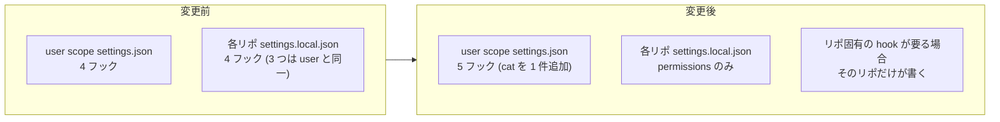

# 42-spec: 運用指示の注入を user スコープへ寄せ、対象の宣言と検出層を作る

この spec は ISSUE-42 の「決めること」4 項目に答える。背景と現状の安全性は issue.md が
canonical なので再掲しない。

## 前提を覆した実測 (2026-09-01)

設計の骨子は、当初の想定 (テンプレートを配って揃える) を実測が覆したことから決まった。

| # | 当初の想定 | 実測 | 出所 |
| --- | --- | --- | --- |
| 1 | テンプレートが canonical | `SessionStart` のコマンド文字列は 2 種あり、**テンプレートと一致するのは 1 リポだけ**。残る 12 リポは別の変種 | 13 リポの `settings.local.json` を JSON で読んで文字列を集計 |
| 2 | project 配線が要る | テンプレートの 4 フックのうち **3 つは user スコープの `home/.claude/settings.json` と同一内容**。project 固有なのは `cat` の 1 本だけ | 両ファイルの突き合わせ |
| 3 | 修復にコミットが要る | `.claude/settings.local.json` は 28 リポすべてで **TRACKED 0** (untracked 19 / absent 9) | `git ls-files --error-unmatch` を 28 リポで実行 |
| 4 | 非空の project hooks は user 側を置換するかもしれない | **置換しない**。project 側に独自 hook を持つリポで、user スコープにしかない `handoff-sentinel session` の生成物が実在する | 生成物の実在を確認 |
| 5 | 配線が欠けた 16 リポすべてが対象 | うち 5 リポは Claude のセッション履歴が 0 件、1 リポは archive 済み。**実際の対象は 10** | `~/.claude/projects/` の実ディレクトリ名と突き合わせ |

実測 1 が示すのは、写しを配る方式では canonical を名乗る写し自身が drift するということである。
実測 2 が示すのは、13 リポで維持してきた配線の 3/4 が最初から冗長だったということである。

この 2 つから骨子が決まる。**配線を揃えるのではなく、配線を要らなくする。**

実測 5 の測り直しについて。最初の測定は projects ディレクトリ名を推測で組み立てたため、
アンダースコアを含むリポが「未使用」に落ちた。実ディレクトリ名との突き合わせで訂正した。
偽陰性は「未適用」という重大な誤報になり、しかも何度引いても同じ答えが返る。

## 決めたこと

### 1. 配置の再現手順の置き場 (issue.md の論点 1 への答え)

dotfiles にセットアップスクリプトを新設する。`bootstrap.sh` には入れない。
issue.md が書いたとおり bootstrap はマシンのセットアップでありリポジトリの初期化ではなく、
責務が違う。スクリプトの本体を dotfiles が持ってよいことはユーザーが明示した。

スクリプトは冪等で、以下だけを行う。

| 実測した状態 | 動作 |
| --- | --- |
| `.hidari/` が無い | 作る |
| `.hidari/private-ops` が無い / dangling | 張り直す |
| 対象リポで `.hidari/` が ignore されていない | **作らずに落ちる** (論点 2 への答え) |
| `.claude/settings.local.json` の `hooks` キーが残っている | 報告する。自動では消さない |

### 2. ignore の保証 (issue.md の論点 2 への答え)

`.hidari/` を ignore しているのは `~/.config/git/.gitignore_global` で、これはマシンローカル
設定である。bootstrap 前のマシンや `core.excludesfile` を持たない環境では ignore されない。

スクリプトは symlink を作る前に `git check-ignore` で対象パスが ignore されることを確かめ、
されていなければ**作らずに落ちる**。symlink の中身は絶対パスなので、追跡候補になった時点で
`macos-user-path` と `email-address` の露出面ができる。gitleaks は 2 層目であり、
1 層目をここで機構化する。

問い合わせは `.hidari/` ではなく `.hidari/private-ops` の形で行う。末尾スラッシュ付きの
ディレクトリパターンは実体が無いと一致しないため、実体を作る前の問い合わせは配下パスで行う。

論点 2 のもう一方である `.cache/` は状態が違う。実測すると、調べた 8 リポはすべて自前の
`.gitignore` でも ignore しており、`check-ignore` が指すのは per-repo 側だった。
つまりこちらはマシンローカル設定に依存していない。global 側にも行はあるが、
それが唯一の防御になっているリポは調べた範囲には無かった。

ただし新しく対象へ加えるリポで同じとは限らない。スクリプトは `.hidari/private-ops` と
`.cache/` の両方について ignore を確かめ、`.cache/` が ignore されていなければ報告する。
**自動では `.gitignore` へ足さない。** 追跡下の変更はコミットを伴い、この spec が
「追跡外だけを機械化する」と決めた境界を越えるためである。

### 3. 公開範囲の注入 (issue.md の論点 3 への答え)

**採らない。** 0.73 秒を全セッションに乗せる対価に見合わない。ネットワーク不通時の挙動も
決めが要る。規範としては user CLAUDE.md に既にあり、今回の主目的の外にある。
この判断を記録することでこの論点を閉じる。

### 4. 取り付けの検査 (issue.md の論点 4 への答え)

二層にする。

| 層 | 実体 | いつ | 見る範囲 | 書き込み |
| --- | --- | --- | --- | --- |
| 実行時 | `guard_probes.PROBES` へ述語 1 件 | 全リポ・毎セッション開始 | 今いるリポ 1 件 | しない |
| 棚卸し | config-guard の**別コマンド** | 手動 | 一覧の全件 | しない |

棚卸し層を `config-guard scan` に混ぜない理由は、`scan` が pre-commit で `always_run` で
あるため。他リポの一時的な状態が dotfiles のコミットを止める形になる。

probe が書き込まない理由は 2 つある。セッション開始時に副作用を持つ hook は、意図しない
作業ツリー (他人のリポの clone、一時ディレクトリ) にも書き込む。そして書き込みが成功すると
次回から probe は無言になるので、間違った対象へ取り付いたことに気づけない。

## 設計

### 配線の移動

user スコープへ足すコマンドはリポ相対で書けるため、そのまま全リポで効く。
`.hidari/private-ops` が無いリポでは `cat` が失敗し、標準エラーを捨てるので無音になる。
つまり **symlink の有無がそのまま opt-in ゲートとして働く**。

リポ固有の hook は project 側に書けば user 側と両方走る (実測 4)。

### 一覧と probe の関係

一覧は制御に参加する。載っているリポでだけ probe が鳴る。

| 一覧に載っている | `.hidari/private-ops` | probe |
| --- | --- | --- |
| はい | 解決する | 無言 |
| はい | 無い / dangling | **鳴る** (取り付けの欠落) |
| いいえ | 無い | 無言 (意図的に対象外) |
| いいえ | ある | **鳴る** (一覧が古い) |

4 象限すべてに意味がある。「意図的に対象外」と「作り忘れ」を区別できるのは、
一覧が意図を持つためである。一覧が無ければこの 2 つは同じ形をとる。

### 一覧のフォーマット

置き場は private-ops。dotfiles は PUBLIC でリポ名を書けない。

載せるのは**対象リポだけ**とする。休眠・archive・Claude 未使用の 11 リポは書かない。
行が増えるのは対象を増やしたときだけになる。

| 規則 | 内容 | 理由 |
| --- | --- | --- |
| 1 行 1 リポ | `$HOME` からの相対パス | 絶対パスを書かないので、万一引用しても露出面を作らない |
| 状態を書かない | 配線済みかどうかは書かない | 状態の canonical はファイルシステム。書けば必ず drift する |
| 行の文法 | 有効 / 無視 / **却下** の 3 分類 | 2 分類だと文法違反が「無視」に吸われて静かに消える |
| 未知の行 | 却下として報告 | 素通りさせない |

行の文法を 3 分類にするのは `claude_config_dir_line_kind` (bootstrap.sh) の作法に倣う。
あちらも追跡外の行指向ファイルを読み、名前をリポジトリへ書かないための外部化である。

一覧を読むコードは dotfiles 側にあるので、テストは環境変数でパスを差し替えて fixture で書く。
これも `CLAUDE_CONFIG_DIRS_FILE` の作法に倣う。private-ops 自体は git 管理にしない。

## 決めなかったこと

| 項目 | 扱い | 理由 |
| --- | --- | --- |
| 追跡下の検査層 (gitleaks / pre-commit) の横展開 | ISSUE-64 が担当 | 実測した母数は 25 ではなく 3。うち 2 はあちらが既に担当している |
| project `apm.yml` の雛形配布 | 配らない | ISSUE-64 が「要るまで置かない」と決定済み。実需が出たリポには足せる (足すのは容易) |
| CLAUDE.md の二重管理の解消 | 範囲外 | 外部リポでは例外を許容する方針 |
| lefthook を使う 2 リポの移行 | 別タスク | 取り付け判定を生成元マーカーで行う必要がある。`.git/hooks/pre-commit` の存在は pre-commit 加入の証拠にならない |

`apm.yml` を後から足すときの落とし穴を記録しておく。`.gitignore` が `.claude/*` で閉じて
`!.claude/skills/` で再包含する形のリポでは、**apm の展開物が追跡下に入る**。
展開先を個別に ignore する先行事例が 1 リポにあるので、それに倣う。
足す前に配下パスで `git check-ignore` を引いて確かめること。

## リスクと検出

| ID | リスク | なぜ静かに壊れるか | 検出 |
| --- | --- | --- | --- |
| R1 | 移行途中に user と project の両方が `cat` を持ち、指示が二重に載る | 二重注入はエラーにならず context が減るだけ | 移行前に**二重に載ることを先に観測**してから project 側を消す |
| R2 | 外部ストレージが未マウントで `cat` が空を返す | 標準エラーを捨てるので無音 | probe が symlink の解決を見る。**外して鳴ることを先に確認**してから戻す |
| R3 | probe が登録簿から静かに落ちる | 登録が減っても他は動き、検査は「沈黙 0 件」を返す | テストで件数ではなく**名前の集合**を pin する |
| R4 | 一覧と実態がズレる | 一覧は git 管理外で diff も履歴も無い | probe の 4 象限が両方向で鳴る |
| R5 | opt-out ができない | user スコープの hook は全リポで走る | 仕様として明示する。対象外リポでは symlink が無いので指示は載らない |
| R6 | 外部ストレージ上の運用文書自身の記述が古くなる | git 管理外なのでどの検査も届かない | **機構では守れない**。移行作業の手順に含める |
| R7 | ignore されない環境で symlink を作る | 作った時点では緑 | スクリプトが `git check-ignore` で確かめ、落ちる |

R6 は正直に「守れない」と書く。検出手段が無いものを検出できるかのように書かない。

## 検証

手動の確認は 2 回に固定する。どちらも対照を先に取る。実施場所は実地の 1 件 (下記) とし、
このリポジトリでは行わない。受け側で確かめないと「配る側では動くが届いていない」を見逃す。

| # | 確認 | 対照 (これが無いと 0 件を健全と誤読する) |
| --- | --- | --- |
| V1 | 対象リポで新セッションを開き、指示が 1 回だけ context に入る | project 側を消す前に開き、**2 回入ることを先に見る** |
| V2 | probe が沈黙しない | symlink を一時的に外し、**鳴ることを先に見る**。鳴ってから戻す |

V1 は機構を外すと壊れることを、V2 は検査が実際に見ていることを示す。

設定の変更が実行中のセッションへ反映されるまでには数回のツール呼び出しぶんの遅れがある。
1 回確認して空でも「反映されない」と決めないこと。

## 実地の 1 件

外部リポ 1 件を受け側の検証対象にする。このリポは配線と symlink が既に充足しており、
今回の変更では追跡下の変更が発生しない。受け側として検証に使える。

このリポには別途 pre-commit を導入する。gitleaks が CI にあるが走査モードが working tree
に限られ、コミット時に止まる層が無い。導入する hook の集合は ISSUE-64 が「汎用のものだけを
採る」として挙げた集合に従う。

## 関連

- ISSUE-53: 配布先の加入状況と写しの drift を見る層が無い。
  この spec の検出層があちらのタスク 4 件を進める。母数の定義は一覧が、
  「hook や CI から呼ぶ以外の土俵」は probe が、実地の 1 件は上記が担当する
- ISSUE-64: relay と studio へ pre-commit と gitleaks を入れる。
  追跡下の検査層はあちらが canonical。この spec は範囲に含めない
- Issue 26: Claude Code フックの共通基盤を集約する。
  テンプレートが載せていた 4 フックの集約先
